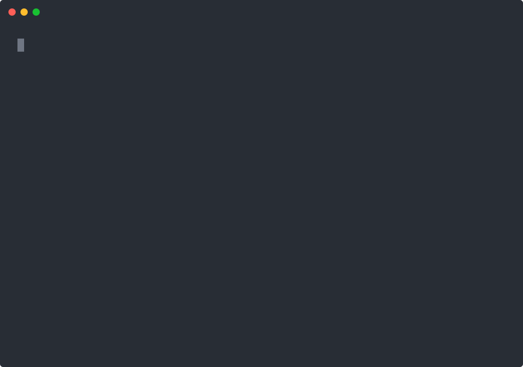

# Hermes Conductor

**One Hermes conductor. Many coding CLIs. Zero trust in self-reports.**

Production orchestration patterns for running external coding agents — Claude Code, OpenCode, Codex CLI, MiMo, agy, or anything else that edits files — under a single [Hermes Agent](https://github.com/NousResearch/hermes-agent) kanban controller.

Distilled from **18 production boards, 367 cards, 289 completed with verified evidence — and every incident that tried to ruin them.**

```
                          ┌──────────────────────┐
                          │   Hermes Conductor   │
                          │  (route-only profile) │
                          │  "Don't do the work.  │
                          │      Route only."     │
                          └──────────┬───────────┘
                 decompose / fan-out / verify / integrate
          ┌──────────────────┬─────┴────────┬──────────────────┐
          ▼                  ▼              ▼                  ▼
   ┌─────────────┐   ┌─────────────┐  ┌─────────────┐  ┌─────────────┐
   │  worktree   │   │  worktree   │  │  worktree   │  │  worktree   │
   │  lane A     │   │  lane B     │  │  lane C     │  │  lane D     │
   │ Claude Code │   │  OpenCode   │  │  Codex CLI  │  │    MiMo     │
   └──────┬──────┘   └──────┬──────┘  └──────┬──────┘  └──────┬──────┘
          │  diff/tests/commits — verified by the controller, never   │
          ▼  trusted from the agent's own report          ▼
   ┌─────────────────────────────────────────────────────────────────┐
   │              canonical integration branch + evidence            │
   └─────────────────────────────────────────────────────────────────┘
```

## Demo

A real dispatch cycle — real board, real gateway dispatcher, real worker profile. Only idle time is compressed; every byte of output is untouched:



What you're watching: the controller creates a card → the gateway dispatcher hands it to a worker profile → the worker implements + tests in the card's workspace → the controller re-runs the tests itself before accepting the evidence. That last step is the whole point.

Raw asciinema cast: [`assets/demo.cast`](assets/demo.cast)

Prefer a slower, narrated cut? [`assets/conductor-demo-narrated.svg`](assets/conductor-demo-narrated.svg) steps through the same run with on-screen commentary — or grab the [MP4](assets/demo-narrated.mp4).

## Why this exists

The multi-harness wave is here — "Hermes as the brain, other agents as the arms." What the bridge demos don't show you is what happens on day 3:

| Failure | What actually happens |
|---|---|
| **Self-report trust** | An external agent says "done, tests pass." Nothing passed. If your controller believes it, your canonical branch rots. |
| **Parallel mutation collision** | Two worker cards land in the same checkout. Both "succeed." One overwrites the other. |
| **Stale-base auto-promotion** | A dependency completes → downstream card auto-promotes → its lane worktree still points at last week's HEAD. Silent divergence. |
| **Approval deadlock loops** | A worker hits a pending-approval command; the dispatcher respawns it forever; your board eats tokens overnight. |
| **Evidence-free "done"** | Cards close with vibes instead of commit IDs and command output. Audits become archaeology. |

Every pattern in this repo exists because we hit the failure above it — in production, at 2am, more than once.

## The golden rules

1. **The orchestrator never implements.** Its SOUL.md says: *"Do not implement. Do not research. Do not write code. Route only."*
2. **External agent self-reports are never card-completion evidence.** The controller verifies the worktree diff, reruns gates, and completes cards with commit IDs + command output.
3. **Every mutating lane gets its own worktree.** Parallel cards sharing a checkout is not a workflow, it's a race condition. `--workspace worktree` or `dir:` — never the canonical checkout.
4. **`--parent` is a dependency edge, not a folder.** Children stay blocked until the parent completes *with evidence*.
5. **Controller-sequential for dependent chains.** "Implement all" on a dependency graph is an ordered queue, not a parallel fan-out — unless the plan proves independence.
6. **Completing a dependency may auto-promote stale lanes.** After every unblock: `git worktree list`, check each promoted lane's HEAD, block-and-restart anything stale.
7. **Standing lanes stay blocked; bounded cron owns execution.** Ready + normal assignee on an eternal lane card = the dispatcher will spawn uncontrolled one-shots.
8. **Complete with evidence or don't complete.** `kanban complete <id> --result "commit abc123, gates green"` — status flips without evidence get reverted.

## Install

The role playbooks are installable Hermes skills:

```bash
# on your orchestrator profile's machine/home:
hermes skills install forcewake/hermes-conductor/skills/kanban-orchestrator

# on each worker profile:
hermes skills install forcewake/hermes-conductor/skills/kanban-worker
```

> `hermes skills install` accepts any `owner/repo/path` GitHub identifier —
> no registry listing needed. The `patterns/` docs are meant to be read by
> the human operating the controller, not installed.

## What's inside

### `patterns/` — the playbooks

| # | Pattern | Solves |
|---|---|---|
| 01 | [Controller-managed external worktree lanes](patterns/01-controller-managed-external-worktree-lanes.md) | **The core pattern.** Launch templates for Claude Code / OpenCode / MiMo / agy lanes, smoke-first discipline, stale-base recovery, completion verification. |
| 02 | [Workspace isolation](patterns/02-workspace-isolation.md) | Same-checkout collisions: `worktree` for parallel mutation, reclaim/block one card at a time. |
| 03 | [Single-repo MCP swarm](patterns/03-single-repo-mcp-swarm.md) | Swarm inside one repo: skill preflight, isolation checks, review-required completion loop, final MCP verification gates. |
| 04 | [Controller-sequential epic finalization](patterns/04-controller-sequential-epic-finalization.md) | Closing an epic after children fan out: PR handoff, integration order, canonical gates. |
| 05 | [Controller-sequential recovery](patterns/05-controller-sequential-recovery.md) | The collision-recovery checklist: reclaim auto-spawned cards, integrate in dependency order, re-check the board after each card. |
| 06 | [Production swarm recovery](patterns/06-production-swarm-recovery.md) | Large completion swarms: research fan-out, task subscriptions, progress watchers. |
| 07 | [Prototype furnace daily digest](patterns/07-prototype-furnace-daily-digest.md) | Standing-lane boards: committed-artifact counting, evidence gates, survivor selection, repo verification. |

### `skills/` — installable role playbooks

| Role | What it is |
|---|---|
| [`kanban-orchestrator`](skills/kanban-orchestrator/SKILL.md) | The decomposition playbook: profile discovery, anti-temptation rules, fan-out/in, reviewer remediation loops, research-swarm artifact contracts. Includes [reviewer-remediation-loop](skills/kanban-orchestrator/references/reviewer-remediation-loop.md) and [research-swarm-artifact-pattern](skills/kanban-orchestrator/references/research-swarm-artifact-pattern.md). |
| [`kanban-worker`](skills/kanban-worker/SKILL.md) | The worker lifecycle: claim → workspace → heartbeat → `kanban_complete(summary, metadata)` or `kanban_block` — plus edge cases that kill workers. |

### `examples/` — cheatsheet

- [`kanban-cheatsheet.md`](examples/kanban-cheatsheet.md) — the commands, in the order you'll actually use them.

## Quickstart

You have [Hermes Agent](https://github.com/NousResearch/hermes-agent) v0.20+ running with the kanban dispatcher enabled (`kanban.dispatch_in_gateway: true`).

```bash
# 1. Board + first controller-managed card
hermes kanban init
hermes kanban create "Ship feature X" \
  --assignee your-worker-profile \
  --workspace worktree \
  --body "Implement per 01-spec.md. Tests green. Complete with commit ID as evidence."

# 2. Give the orchestrator profile its constitution (SOUL.md):
#    "Do not implement. Do not research. Do not write code. Route only."

# 3. Watch the controller — not the agents — close cards
hermes kanban watch
```

Then read [pattern 01](patterns/01-controller-managed-external-worktree-lanes.md) before your second card. It's the difference between a demo and a pipeline.

## Battle scars (where these came from)

- A "successful" overnight swarm where three lanes silently built on a base that no longer existed → patterns 01, 05.
- Two worker cards editing the same checkout for hours before anyone noticed → patterns 02, 05.
- A card auto-promoted by its dependency completing, dispatched into a worktree two days stale → pattern 01's stale-base check.
- A dispatcher loop respawning a worker stuck on an approval, all night → the standing-lane rule.
- Review findings that "fixed" themselves because the reviewer card and the fix card raced → the remediation loop in `skills/`.

None of these are hypothetical. All of them have a recovery checklist here.

## Requirements

- Hermes Agent v0.20+ (kanban CLI + gateway dispatcher)
- External coding CLIs installed and authenticated (any subset — Claude Code, OpenCode, Codex, MiMo, agy, custom)
- git worktrees enabled in your environment

## Contributing

Ran a multi-harness board and hit a failure none of these patterns cover? Open an issue with the incident — recovery playbooks from real failures are exactly what this repo collects.

## License

[MIT](LICENSE) — battle-tested by necessity, shared so you can skip the 2am part.
